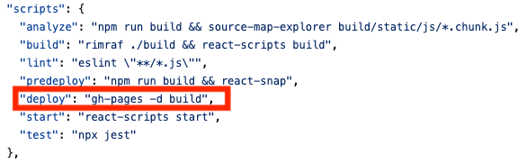
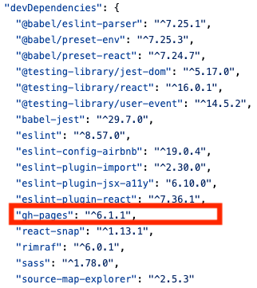
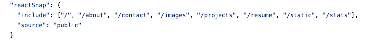

# Personal Website

Welcome to my [personal website](https://cty20010831.github.io/personal_site/)! This is an [MIT licensed](https://github.com/mldangelo/personal-site/blob/main/LICENSE) React-based Jamstack application. It offers a simple interface, easy modifications, static export capabilities, and free automatic deployments via [GitHub Pages](https://pages.github.com/).

## 🚀 Features

- Built with modern JavaScript, using tools and frameworks like [create-react-app](https://github.com/facebook/create-react-app), [React-Router](https://reactrouter.com/), and SCSS.
- Automated workflows via [GitHub Actions](https://github.com/features/actions).
- And more!

## 🛠 Adapting this Project

Want to create your own personal website based on this project? You can set it up in as little as 30 minutes! Follow the setup instructions below and check out the **[detailed guide and checklist](./docs/adapting-guide.md)** on adapting this project to your needs. If you encounter any challenges, don't hesitate to contact me through an issue or email at [help@mldangelo.com](mailto:help@mldangelo.com).

## 🤝 Contributing

Your contributions are warmly welcomed! If you wish to contribute, please review the [design goals](./docs/design-goals.md), [roadmap](./docs/roadmap.md), and [contributing guidelines](./docs/contributing.md). For any bugs or suggestions, you can reach out via email, submit a pull request (I'd be happy to get you a coffee as a thank-you!), or open an issue.

## 🔧 Dependencies

Ensure you have [node](https://nodejs.org/) >= v16. Optionally, use [nvm](https://github.com/nvm-sh/nvm#installing-and-updating) to manage node versions.

## 🚀 Setup and Running

1. Clone the repository:

   ```bash
   git clone git://github.com/mldangelo/personal-site.git
   cd personal-site
   ```

2. (Optional) Ensure you're on Node v16 or higher:

   ```bash
   # Install nvm (make sure to fetch the latest version)
   curl -o- https://raw.githubusercontent.com/nvm-sh/nvm/v0.40.1/install.sh | bash

   # Install Node.js
   nvm install
   node --version
   ```

3. Install dependencies:

   ```bash
   npm install
   ```

4. Start the application:

   ```bash
   npm start
   ```

By default, the application should be available at [http://localhost:3000/](http://localhost:3000/).

## 🚢 Deploying
Here, I added lines under `package.json` to directly deploy using gh-pages without needing to using github workfow (`.github/workflows/github-pages/yml` deleted). 








Now, to update changes and deploy it to my personal website, simply run:
```bash
npm run build

npm run deploy
```

This [website](https://create-react-app.dev/docs/deployment/#github-pages) provides useful information on how to deploy the webpage to CDN. 

## 🙌 Acknowledgements

- Initial template from [Future Imperfect](https://html5up.net/future-imperfect) by [@ajlkn](https://github.com/ajlkn) for [HTML5 UP](html5up.net).
- Special thanks to [@typpo](https://github.com/typpo) for tirelessly answering all of my node.js and react questions.
- Kudos to [@notrueblood](https://github.com/notrueblood)[<sup>[1]</sup>](https://github.com/mldangelo/personal-site/pull/218) and [@sjhsieh](https://github.com/sjhsieh)[<sup>[2]</sup>](https://github.com/mldangelo/personal-site/issues/168) for their constructive feedback.
